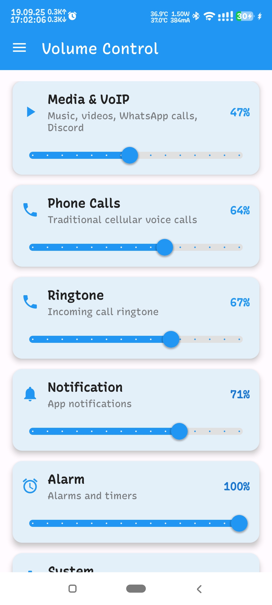
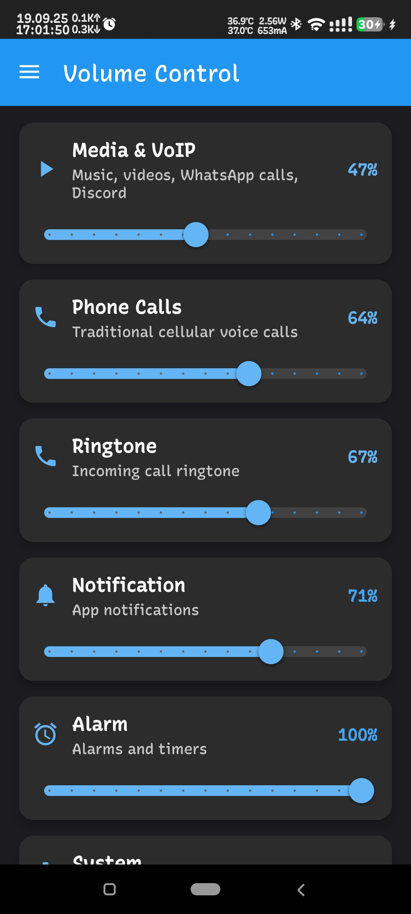
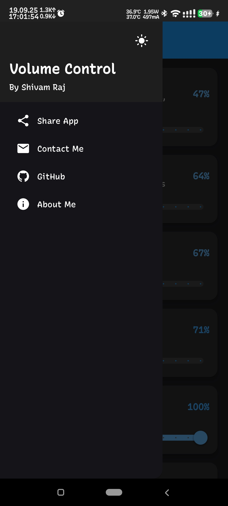
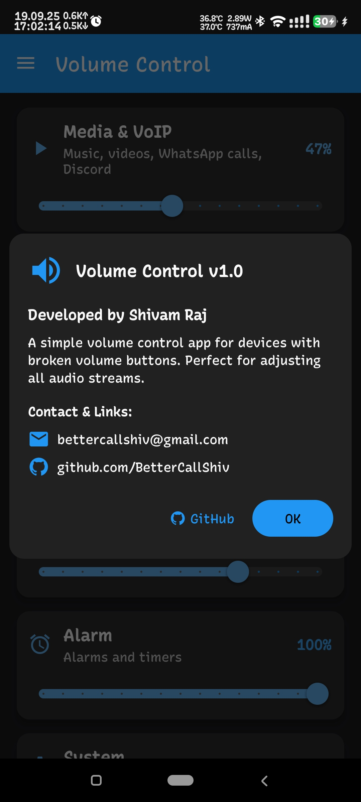

# 🔊 VolumeControl

**Volume Manager for Android**

A powerful and intuitive volume control application that gives you precise control over all your device's audio streams with a beautiful Material Design interface.

## ✨ Features

- **Complete Volume Control**: Manage all audio streams - Media, Voice Call, Ringtone, Notification, Alarm and System
- **Real-time Updates**: Instant volume level updates with visual percentage indicators
- **Material Design**: Modern, clean interface with smooth animations and transitions
- **Dark/Light Theme**: Toggle between dark and light themes with automatic system integration
- **Permission Management**: Smart permission handling with clear user guidance
- **Haptic Feedback**: Subtle vibration feedback for enhanced user experience
- **Navigation Drawer**: Easy access to sharing, contact, and about features

## 📱 Screenshots

  <table>
    <tr>
      <td></td>
      <td></td>
    </tr>
    <tr>
      <td></td>
      <td></td>
    </tr>
  </table>

*Clean modern interface with intuitive volume sliders and real-time feedback*

## 🤝 Contributing

Contributions are welcome! Please feel free to submit a Pull Request.

1. Fork the repository
2. Create your feature branch
3. Commit your changes
4. Push to the branch
5. Open a Pull Request

## 📄 License

This project is open source and available under the [MIT License](LICENSE).

## 🐛 Bug Reports & Feature Requests

If you encounter any issues or have feature suggestions:
- Open an issue on [GitHub Issues](https://github.com/BetterCallShiv/VolumeControl/issues)
- Contact via email: [bettercallshiv@gmail.com](mailto:bettercallshiv@gmail.com)

## 👨‍💻 Author

**Shivam Raj** ([@BetterCallShiv](https://github.com/BetterCallShiv))
- Email: [bettercallshiv@gmail.com](mailto:bettercallshiv@gmail.com)
- GitHub: [github.com/BetterCallShiv](https://github.com/BetterCallShiv)
